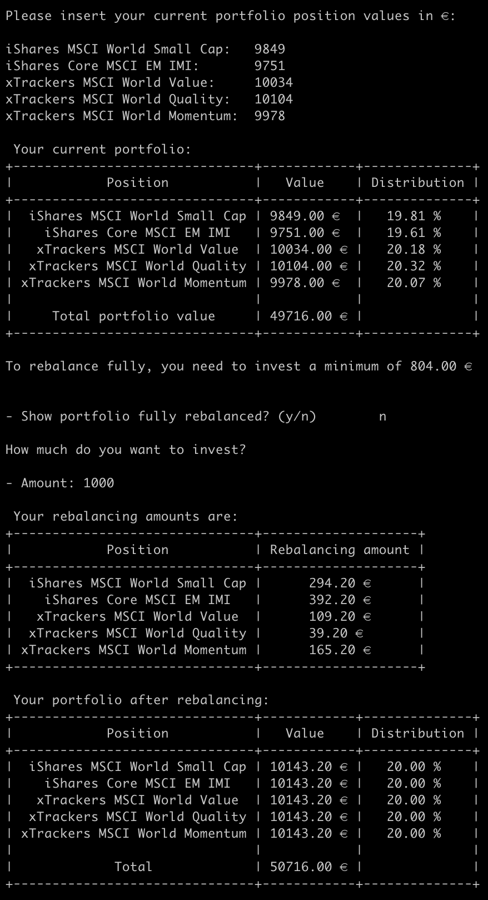
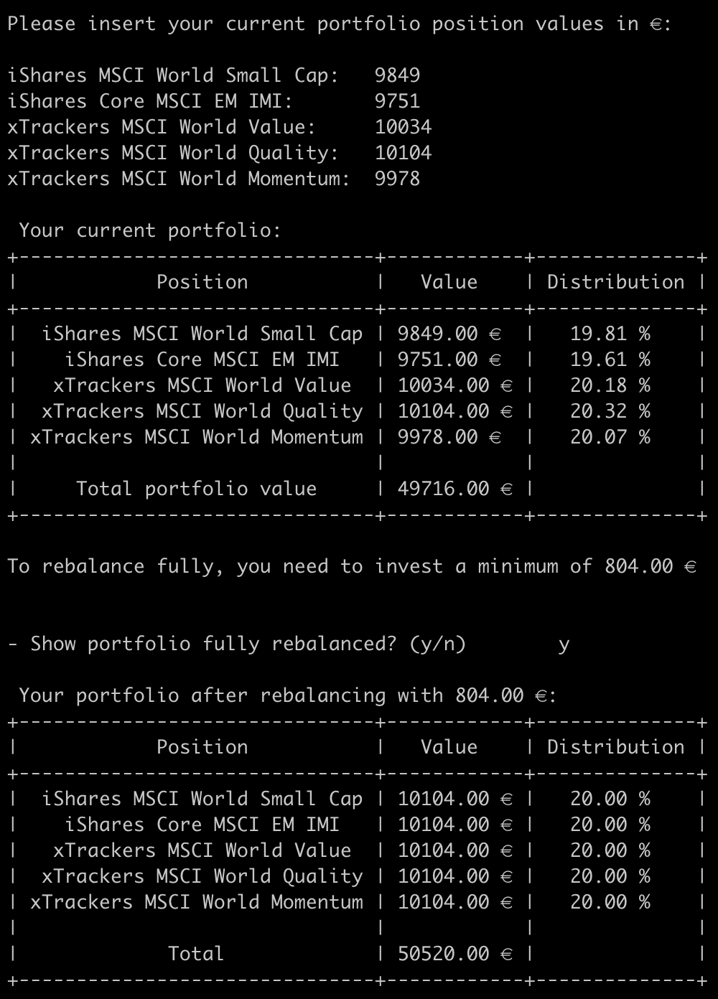
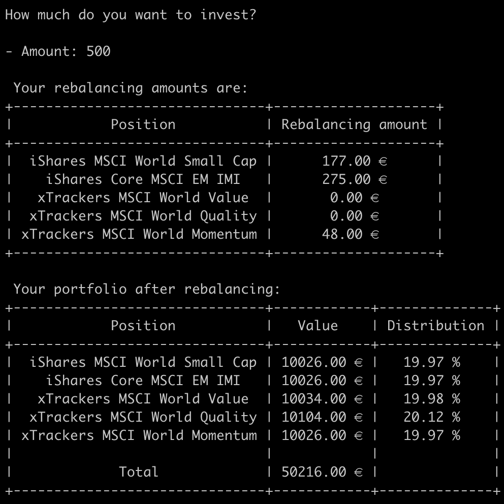

<!-- PROJECT SHIELDS -->
<!--
*** We're using markdown "reference style" links for readability.
*** Reference links are enclosed in brackets [ ] instead of parentheses ( ).
*** See the bottom of this document for the declaration of the reference variables
*** for contributors-url, forks-url, etc. This is an optional, concise syntax you may use.
*** https://www.markdownguide.org/basic-syntax/#reference-style-links
-->

[![Contributors][contributors-shield]][contributors-url]
[![Forks][forks-shield]][forks-url]
[![Stargazers][stars-shield]][stars-url]
[![Issues][issues-shield]][issues-url]

<!-- PROJECT LOGO -->
<br />
<p align="center">
  <h3 align="center">Cash Flow Rebalancing Calculator</h3>

  <p align="center">
    by Leon Beckert
    <br />
    <br />
    <a href="https://github.com/leonbeckert/cash-flow-rebalancing-calculator/issues">Report Bug</a>
    ·
    <a href="https://github.com/leonbeckert/cash-flow-rebalancing-calculator/issues">Request Feature</a>
  </p>
</p>

<!-- TABLE OF CONTENTS -->

## Table of Contents

-   [About the Project](#about-the-project)
    -   [Built With](#built-with)
-   [Getting Started](#getting-started)
    -   [Prerequisites](#prerequisites)
    -   [Installation](#installation)
-   [Roadmap](#roadmap)
-   [Contributing](#contributing)
-   [License](#license)
-   [Contact](#contact)
-   [Acknowledgements](#acknowledgements)

<!-- ABOUT THE PROJECT -->

## About The Project

"Cash Flow Rebalancing" promises the advantages (additional returns) of regular portfolio rebalancing without its disadvantages (taxes, transaction costs).

In classic portfolio rebalancing, a rebalancing adjustment occurs once every quarter, semester or yearly. Assets that have performed better and are now overweight get sold off and the resulting cash inflow gets invested in the underperformers. The result is a completely rebalanced portfolio.

The disadvantages of this approach are clear: Gains have to be realized, taxes have to be paid and transaction costs occur for every asset.

"Cash Flow Rebalancing" helps us defer taxation and reduce transaction cost.

By only investing in the assets that negatively deviate the most from our target distribution we do not need to sell any assets. This can be done on a monthly basis in our savings phase and reversely (selling the overweight assets) in the consumption phase.

In the savings phase we are deffering taxation indefinitely in a buy-and-hold strategy because we do not realize any gains. At the time of writing (2023), monthly savings plans on ETFs are widely available and mostly free in the western world. Using this strategy, we can expect 0.1% to 0.4% additional yearly returns when rebalancing the same asset class: globally diversified stock ETFs (Gerd Kommer 2018).

This cash flow rebalancing calculator offers users the ability to set up their portfolio structure initially within the python executable only returning monthly (or yearly) to calculate their cash flow rebalancing amounts.



Rebalancing fully with an amount that is larger than the necessary rebalancing amount



Rebalancing fully in detail with the exact amount needed



Approximating our target distributions with less cash flow

### Built With

-   [Python](https://www.python.org)
-   [NumPy](https://numpy.org)
-   [prettytable](https://pypi.org/project/prettytable/)


<!-- GETTING STARTED -->

## Getting Started

To get a local copy up and running follow these simple steps.

### Prerequisites

This is a list of things you need to use the software and how to install them.

-   [Python](https://www.python.org/downloads/)

### Installation

1. Clone the repo

```sh
git clone https://github.com/leonbeckert/cash-flow-rebalancing-calculator.git
```

2. Install NumPy and prettytable

```sh
pip install numpy
```
```sh
pip install prettytable
```

3. Run python script

```sh
python cash_flow_rebalancing_calculator.py
```

<!-- ROADMAP -->

## Roadmap

See the [open issues](https://github.com/leonbeckert/cash-flow-rebalancing-calculator/issues) for a list of proposed features (and known issues).

<!-- CONTRIBUTING -->

## Contributing

Contributions are what make the open source community such an amazing place to be learn, inspire, and create. Any contributions you make are **greatly appreciated**.

Before contributing please read our [Code Of Conduct](https://github.com/leonbeckert/cash-flow-rebalancing-calculator/blob/main/CODE_OF_CONDUCT.md).

1. Fork the Project
2. Create your Feature Branch (`git checkout -b feature/AmazingFeature`)
3. Commit your Changes (`git commit -m 'Add some AmazingFeature'`)
4. Push to the Branch (`git push origin feature/AmazingFeature`)
5. Open a Pull Request

<!-- LICENSE -->

## License

This project is licensed under the [Creative Commons Attribution-NonCommercial-ShareAlike 4.0 International License](http://creativecommons.org/licenses/by-nc-sa/4.0/). See `LICENSE` for more information.

<!-- CONTACT -->

## Contact

email: [beckert@leon.fm](mailto:beckert@leon.fm)

Project Link: [https://github.com/leonbeckert/cash-flow-rebalancing-calculator](https://github.com/leonbeckert/cash-flow-rebalancing-calculator)

<!-- ACKNOWLEDGEMENTS -->

## Acknowledgements

Creator:

-   [Leon Beckert (Linkedin)](https://www.linkedin.com/in/leon-beckert-15508a18b/)

<!-- MARKDOWN LINKS & IMAGES -->
<!-- https://www.markdownguide.org/basic-syntax/#reference-style-links -->

[contributors-shield]: https://img.shields.io/github/contributors/leonbeckert/cash-flow-rebalancing-calculator.svg?style=flat-square
[contributors-url]: https://github.com/leonbeckert/cash-flow-rebalancing-calculator/graphs/contributors
[forks-shield]: https://img.shields.io/github/forks/leonbeckert/cash-flow-rebalancing-calculator.svg?style=flat-square
[forks-url]: https://github.com/leonbeckert/cash-flow-rebalancing-calculator/network/members
[stars-shield]: https://img.shields.io/github/stars/leonbeckert/cash-flow-rebalancing-calculator.svg?style=flat-square
[stars-url]: https://github.com/leonbeckert/cash-flow-rebalancing-calculator/stargazers
[issues-shield]: https://img.shields.io/github/issues/leonbeckert/cash-flow-rebalancing-calculator.svg?style=flat-square
[issues-url]: https://github.com/leonbeckert/cash-flow-rebalancing-calculator/issues
[license-shield]: https://img.shields.io/github/license/leonbeckert/cash-flow-rebalancing-calculator.svg?style=flat-square
[license-url]: https://creativecommons.org/licenses/by/4.0/deed.de
[product-screenshot-1]: images/screenshot.png
[product-screenshot-2]: images/screenshot2.png
[product-screenshot-3]: images/screenshot3.png